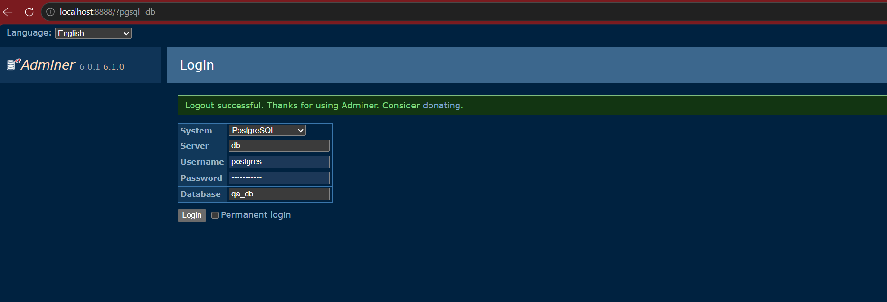
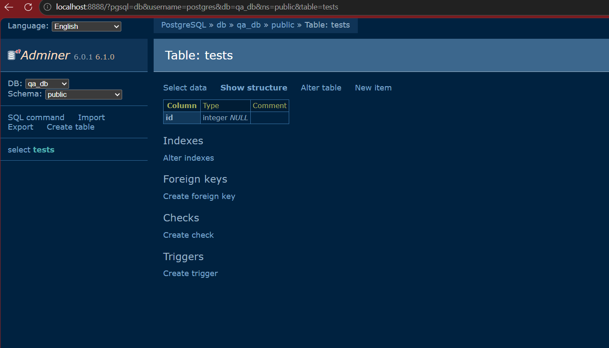

# Rezolvare

## Screenshot Adminer

## Importanta flag-ului -v
Flag-ul `-v` din comanda `docker compose down -v` sterge si volumele asociate serviciilor. Intr-un flux de lucru QA, acest lucru este important pentru a reseta complet mediul si datele persistente, astfel incat urmatoarea rulare sa porneasca de la o stare curata.